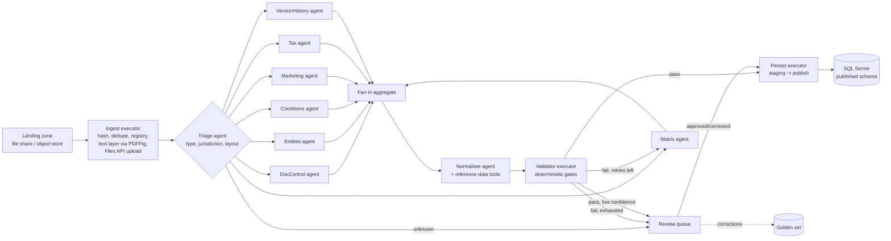

# Cross-Border Instruction Extraction Service (CBIX) — Solution Design

| Field | Value |
|---|---|
| Status | Draft v0.3 — for architecture review |
| Date | 16 August 2026 |
| Owner | Cross-Border Data Engineering |
| Audience | Engineering leads, solution architects, Legal Ops stakeholders |
| Classification | Public — synthetic specimen / portfolio sample |
| Constraints | No Azure services. PoC models via the Anthropic Claude API. |
| Related artifacts | `Cross_Border_Trading_Legal_Instruction_DE_SPECIMEN.pdf`, `..._CH_SPECIMEN.pdf`, `cbti_country_ground_truth.json` (golden set v0) |

## 1. Executive summary

CBIX converts per-country Cross-Border Trading Legal Instruction PDFs into validated relational data. The pipeline is a Microsoft Agent Framework (MAF) workflow in .NET running on the bank's own container platform: deterministic executors handle ingestion, validation and persistence, while Claude-backed agents are used only where judgment is genuinely required — section extraction, footnote resolution and taxonomy normalisation. Claude's native PDF mode replaces a separate document-layout service: the API processes every page as both extracted text and a page image, so the model reads the permission matrix visually. Every extracted field carries provenance (page, verbatim source snippet, confidence, model and prompt version), every run is checkpointed and resumable, and nothing reaches the published schema without passing deterministic validation and, where confidence is insufficient, human review. Accuracy is enforced by a golden set and a regression gate on every prompt or model change.

The governing principle throughout: **agents propose, code disposes.** No agent has database access; agents produce typed candidates that code validates and persists.

## 2. Problem statement

The bank maintains one legal instruction document per jurisdiction. Each defines which group entity may conduct which product or service, cross-border, for which client category, under what conditions. The operative content — notably the product × client-category permission matrix with footnote references — is needed downstream as queryable relational data, but exists only as PDF. Manual re-keying is slow, error-prone and unauditable; documents are revised on annual review cycles and ad hoc, and their formatting drifts across jurisdictions and versions (different client-category schemes such as MiFID II vs FinSA, tables in one country, bullets in another).

### 2.1 Goals

The service must extract the defined section set (document control, entities and legal basis, permission matrix, conditions, marketing rules, documentation requirements, tax notes, version history) into the target schema; achieve production-grade accuracy with a human-review safety net; retain field-level provenance sufficient for audit; persist version-aware records that respect the supersession chain between document versions; and make extraction quality measurable and regression-tested.

### 2.2 Non-goals

CBIX does not interpret or summarise legal positions — it transposes what the document states. It does not author or amend documents. Near-real-time processing is out of scope; documents arrive in low volume and batch latency of minutes is acceptable. Version 1 is scoped to the CBTI country-manual family; it is not a general-purpose document AI platform, though the architecture deliberately generalises (see §10, Phase 3).

## 3. Why an agentic pipeline, why MAF, why the Claude API

Classic template-based IDP fails here because layouts drift per jurisdiction and per version, matrix cells encode composite values (`PR` with superscript condition refs) that must be joined to prose footnotes, and client-category columns follow different regulatory taxonomies that require normalisation. These are reasoning tasks. Conversely, schema validation, referential-integrity checks and database writes are emphatically not reasoning tasks and must never be delegated to a model.

**MAF** fits because it makes exactly this split natural: workflows are directed graphs of executors, where an executor is either an AI agent or plain code, connected by edges that support conditional routing and parallelism. Execution proceeds in supersteps with a checkpoint written at the end of each, so long-running runs — including runs paused for human review — survive restarts and resume where they stopped. Built-in request/response ports provide the human-in-the-loop mechanism. Critically for our constraints, MAF is an open-source .NET framework with no Azure dependency: it runs wherever .NET runs, and its agents sit on the `Microsoft.Extensions.AI` `IChatClient` abstraction, which makes the model provider pluggable.

**The Claude API** slots in through MAF's own Anthropic provider integration: the `Microsoft.Agents.AI.Anthropic` package (prerelease; `dotnet add package Microsoft.Agents.AI.Anthropic --prerelease`), which wraps an `AnthropicClient` and yields a standard MAF agent via `client.AsAIAgent(model:, name:, instructions:)`. The value is that there is no separate SDK plumbing to write and no bespoke `IChatClient` adapter to maintain — the object handed to the workflow is an ordinary `AIAgent`, indistinguishable from one backed by any other provider. **LLM-agnosticism is a hard requirement here, not an aspiration:** no Anthropic type may leak outside a single provider-adapter layer. Pipeline, executor and agent-definition code depends only on MAF's `AIAgent` and `Microsoft.Extensions.AI`'s `IChatClient` abstractions plus a provider capability profile, so moving to another provider — Groq, for instance, whose API is OpenAI-compatible and therefore reachable through the MAF/`Microsoft.Extensions.AI` OpenAI integration pointed at its endpoint — is a configuration change, not a code change. That claim is made testable rather than asserted: the CI/BDD suite runs the entire workflow against a stub `IChatClient` with no Anthropic dependency on the path, and that run is the acceptance criterion for agnosticism. Two Claude capabilities nonetheless carry the design: **native PDF mode**, where the platform converts each page into an image and extracts its text, giving the model both — which is precisely what the permission matrix needs and removes any separate layout/OCR service from the architecture; and **structured outputs**, where responses are constrained to a JSON schema derived from the C# contract, eliminating parse-and-retry plumbing. These, along with `cache_control` prompt caching, Files API upload with `file_id` reuse, and extended thinking, are reached through the integration's raw-representation escape hatch — a `RawRepresentationFactory` returning `MessageCreateParams` on the chat options, and `AnthropicClient.Beta.Files` for uploads — and every such call site lives inside the Claude provider adapter, nowhere else.

## 4. Architecture overview



One workflow run per document, pulled from a work queue. The ingest executor prepares the document (local text layer + one upload to the Claude Files API); the triage agent profiles it; section extractors run concurrently via fan-out/fan-in, each asking a targeted question against the same cached document; a normaliser maps raw values onto canonical taxonomies; a deterministic validator gates everything; failures loop back with structured feedback or escalate to human review; the persist executor writes staging then publishes transactionally.

## 5. Detailed design

### 5.1 Ingestion and document preparation (code, no LLM)

Documents land on a designated file share or S3-compatible object store watched by the ingest worker. The executor computes a content hash for idempotency and deduplication, records the document in a registry table, and prepares two representations. First, a **local text layer** extracted with PDFPig (.NET): this is the corpus the validator later uses for grounding checks, and it costs nothing per call. Second, the PDF is uploaded once to the **Claude Files API** and referenced by `file_id` in every subsequent agent call, with `cache_control` set on the document block so prompt caching applies. The API's PDF mode does the heavy lifting that a layout service would otherwise do: each page is processed as both extracted text and a rendered image, so agents see the visual structure of the permission matrix, and scanned documents work without a separate OCR step. Country manuals run a handful of pages — far inside the API's PDF limits (600 pages, 32 MB per request) — at a typical cost of roughly 1,500–3,000 text tokens per page plus image tokens, largely absorbed by caching across the seven section agents.

This is a deliberate simplification versus a dedicated layout service: one cached document, seven targeted questions. The trade-off is that the API does not return cell bounding boxes; provenance is anchored by page number and verbatim snippet instead, which §5.6 makes verifiable.

Because document presentation is the one place where providers differ most sharply, it is isolated behind a single port — a document-presentation strategy, working name `IDocumentContentProvider` — selected by the active provider's capability profile. The **Claude profile** is the path described above and remains the default: upload once to the Files API, reference the `file_id` as a native PDF block, set `cache_control`. A **generic vision profile** is the agnosticism fallback: the PDFPig text layer plus page images rendered locally, sent as ordinary multimodal content. A **text-only profile** is the degraded case — text layer alone, no visual matrix reading — and is flagged as such in the eval harness rather than silently accepted. Structured outputs follow the same shape: schema-constrained where the provider supports it, JSON mode plus deterministic validate-and-retry where it does not, reusing the validator that §5.6 already requires. Only the strategy implementations know which profile is in play; the ingest executor and the section agents do not.

### 5.2 Workflow topology and hosting

The graph is defined once with `WorkflowBuilder`: ingest → triage → fan-out to seven section extractors → fan-in barrier → normaliser → validator → conditional edges to persist, retry or review. Checkpoint storage is pluggable; we back it with SQL Server (a thin custom `CheckpointStorage` provider if one isn't shipped for it), so a crashed run or a run awaiting a reviewer resumes at the last superstep without re-executing — or re-paying for — completed LLM calls. Hosting is a plain .NET worker in a Docker container on the existing Kubernetes estate. The work queue is a SQL-table queue for the PoC (zero new infrastructure) and the existing Kafka estate or RabbitMQ for production.

```csharp
// Illustrative topology — API names per current MAF docs
var wf = new WorkflowBuilder(ingest)
    .AddEdge(ingest, triage)
    .AddFanOutEdge(triage, targets: sectionAgents)          // 7 extractors in parallel
    .AddFanInBarrierEdge(aggregate, sources: sectionAgents)
    .AddEdge(aggregate, normaliser)
    .AddEdge(normaliser, validator)
    .AddEdge(validator, persist,  condition: r => r.Passed && r.MinConfidence >= 0.90)
    .AddEdge(validator, retry,    condition: r => !r.Passed && r.Attempts < 2)
    .AddEdge(validator, review,   condition: r => r.NeedsHuman)
    .AddEdge(review, persist)
    .Build();
```

### 5.3 Triage agent

A Haiku-tier model receives the cached document and the registry metadata and returns a `DocumentProfile` (document type, jurisdiction ISO, document reference, version, layout family, confidence). Conditional edges use this to select prompt variants per layout family and to short-circuit non-CBTI documents to the review queue rather than guessing. Triage is deliberately cheap; it runs on every document and its only job is routing.

### 5.4 Section extraction agents

One agent per section, run concurrently against the same cached `file_id`, each with a prompt scoped to its section and instructed to use logical page numbers. Decomposition is a core design decision, not an implementation detail: small per-section JSON schemas get materially better structured-output adherence than one mega-schema, sections retry independently so a matrix failure never re-runs the tax extraction, sections parallelise, and confidence is measurable per section.

| Agent | Focus | Output contract | Model tier |
|---|---|---|---|
| DocControl | Document-control block | `DocControlSection` | Haiku 4.5 |
| Entities | Entities & legal basis | `EntitiesSection` | Haiku 4.5 |
| **Matrix** | Permission matrix (visual table) | `MatrixSection` | Sonnet 4.6 |
| Conditions | Footnotes / conditions | `ConditionsSection` | Haiku 4.5 |
| Marketing | Marketing & solicitation rules | `MarketingSection` | Haiku 4.5 |
| Tax | Tax considerations | `TaxSection` | Haiku 4.5 |
| VersionHistory | Version-history table | `VersionHistorySection` | Haiku 4.5 |

All agents use **structured outputs**: the response is constrained to a JSON schema derived from the C# contract via whatever structured-output mechanism the active provider exposes (schema-constrained decoding or strict tool use where available; JSON mode plus the validator's deterministic retry loop where not — see §5.1). Tiering is a starting point, not dogma — the eval harness (§5.9) decides it: if Haiku's field accuracy matches Sonnet's on a section, Haiku keeps it; if Sonnet underperforms on the matrix, that one agent escalates to the top Opus/Fable tier. Every scalar is wrapped in a provenance envelope:

```csharp
public sealed record ExtractedField<T>(
    T?      Value,
    int?    SourcePage,
    string? SourceSnippet,   // verbatim text copied from the document
    double  Confidence);
```

Prompting rules are uniform: extract, never interpret; copy snippets verbatim; return null when a field is absent rather than inventing; never use knowledge from outside the supplied document. The **matrix agent** is the hard case: because PDF mode presents each page visually, it reads the table as a table, and it must emit exactly `products × categories` records — one per cell with status code and parsed superscript condition references — a count the validator enforces. Its escalation path on failure is a focused re-run against only the matrix pages with the validator's findings in context, then model-tier escalation, then review. Optionally, the API's citations feature can be enabled on document blocks so responses carry platform-anchored page references alongside the self-reported snippets.

### 5.5 Normalisation agent with tools

Raw client categories differ by regime — the German manual uses four MiFID II categories, the Swiss uses three FinSA categories — and downstream consumers need one canonical taxonomy. Normalisation is dictionary-first: a maintained mapping table resolves known values deterministically, and the agent is invoked only for unmapped values, with the canonical enum and definitions in context and reference-data lookups (entity master, LEI) exposed as `AIFunction` tools. Anything the agent cannot map with high confidence is emitted as `UNMAPPED` and routes to review; approved mappings are added to the dictionary so the same question is never asked twice.

### 5.6 Deterministic validation

The validator is plain code and is the only authority on whether a run may persist. Gates, in order: JSON schema and enum conformance; **grounding** — every `SourceSnippet` must appear verbatim in the PDFPig text layer (a string containment check, and the cheapest hallucination defence available); referential integrity — every condition reference cited in a matrix cell must resolve to an extracted condition; completeness — the matrix must contain every product × category cell, version history must be monotonic, effective date must precede review date; and cross-document checks — the `supersedes` reference should resolve to a known prior version, with a warning (not a failure) when it predates the registry.

Failures produce a structured `ValidationReport` targeted at the offending section. The retry edge re-invokes only the failing agent with the report appended to its context — "cell (OTC derivatives — uncleared, Professional) missing"; "snippet not found on page 2" — for at most two attempts before escalating. Targeted retry with machine-generated feedback is what makes the agentic loop pay for itself.

### 5.7 Human-in-the-loop

Runs pause for review on validation exhaustion, sub-threshold confidence, unmapped taxonomy values, or unknown layout at triage — and during the pilot phase, on every document (see §10). The pause is implemented with MAF's request/response port: the workflow checkpoints and idles at zero compute cost; the review item lands in a queue table; a lightweight internal UI renders the PDF page beside each extracted field, locating the source region by matching the snippet against the page's text layer; the reviewer approves, corrects or rejects; the response resumes the workflow at the persist step. Every correction is stored as a (document, field, model-value, human-value) tuple and appended to the golden set — review is not just a safety net, it is the flywheel that improves the system.

### 5.8 Persistence (code)

The persist executor writes the full run output to a staging schema, then publishes to the target schema in a single transaction. Published records are effective-dated on the natural key `(doc_ref, version)`; publishing version 3.2 of the German manual closes the validity window of 3.1 rather than deleting it, preserving the supersession chain the documents themselves declare. Alongside the business tables, an `extraction_runs` record captures model configuration, prompt versions, token cost and outcome, and `field_provenance` rows preserve page, snippet, confidence and reviewer per field — the audit trail that makes a model-populated golden source defensible.

### 5.9 Evaluation and regression

The golden set starts as the synthetic specimens plus their ground-truth JSON and grows with every human correction. A CI harness replays the golden set against the pipeline and reports field-level exact-match precision/recall, matrix **cell accuracy** (the headline metric), condition-linkage F1 and category-normalisation accuracy. No prompt, model version or configuration change ships without a green run. In production, the same metrics are sampled continuously against reviewed documents to detect drift. Backfill of the historical document estate runs through the **Message Batches API**, which processes asynchronously at discounted rates — a good fit since backfill has no latency requirement.

## 6. Data model (published schema, T-SQL sketch)

```sql
CREATE TABLE dbo.country_documents (
    doc_ref            varchar(40)   NOT NULL,
    doc_version        varchar(10)   NOT NULL,
    country_iso        char(2)       NOT NULL,
    doc_status         varchar(20)   NOT NULL,
    effective_date     date          NOT NULL,
    review_date        date          NULL,
    supersedes_ref     varchar(60)   NULL,
    document_owner     nvarchar(200) NULL,
    extraction_run_id  uniqueidentifier NOT NULL,
    valid_from         datetime2     NOT NULL,
    valid_to           datetime2     NULL,          -- open = current
    CONSTRAINT pk_country_documents PRIMARY KEY (doc_ref, doc_version)
);

CREATE TABLE dbo.permission_matrix (
    doc_ref                    varchar(40)   NOT NULL,
    doc_version                varchar(10)   NOT NULL,
    product                    nvarchar(120) NOT NULL,
    client_category_raw        nvarchar(60)  NOT NULL,  -- as printed (MiFID/FinSA/...)
    client_category_canonical  varchar(40)   NOT NULL,  -- house taxonomy
    status_code                varchar(4)    NOT NULL
        CONSTRAINT ck_pm_status CHECK (status_code IN ('P','PR','RS','NP','N/A')),
    CONSTRAINT pk_permission_matrix
        PRIMARY KEY (doc_ref, doc_version, product, client_category_raw),
    CONSTRAINT fk_pm_doc FOREIGN KEY (doc_ref, doc_version)
        REFERENCES dbo.country_documents (doc_ref, doc_version)
);

CREATE TABLE dbo.conditions (
    doc_ref        varchar(40)    NOT NULL,
    doc_version    varchar(10)    NOT NULL,
    condition_ref  int            NOT NULL,
    condition_text nvarchar(2000) NOT NULL,
    CONSTRAINT pk_conditions PRIMARY KEY (doc_ref, doc_version, condition_ref),
    CONSTRAINT fk_cond_doc FOREIGN KEY (doc_ref, doc_version)
        REFERENCES dbo.country_documents (doc_ref, doc_version)
);

CREATE TABLE dbo.matrix_conditions (   -- many-to-many: cell -> footnotes
    doc_ref             varchar(40)   NOT NULL,
    doc_version         varchar(10)   NOT NULL,
    product             nvarchar(120) NOT NULL,
    client_category_raw nvarchar(60)  NOT NULL,
    condition_ref       int           NOT NULL,
    CONSTRAINT pk_matrix_conditions PRIMARY KEY
        (doc_ref, doc_version, product, client_category_raw, condition_ref),
    CONSTRAINT fk_mc_cell FOREIGN KEY (doc_ref, doc_version, product, client_category_raw)
        REFERENCES dbo.permission_matrix (doc_ref, doc_version, product, client_category_raw),
    CONSTRAINT fk_mc_cond FOREIGN KEY (doc_ref, doc_version, condition_ref)
        REFERENCES dbo.conditions (doc_ref, doc_version, condition_ref)
);

CREATE TABLE dbo.field_provenance (
    provenance_id   bigint IDENTITY PRIMARY KEY,
    doc_ref         varchar(40)    NOT NULL,
    doc_version     varchar(10)    NOT NULL,
    table_name      sysname        NOT NULL,
    record_key      nvarchar(400)  NOT NULL,
    field_name      sysname        NOT NULL,
    source_page     int            NULL,
    source_snippet  nvarchar(1000) NULL,
    confidence      decimal(4,3)   NULL,
    model_id        varchar(80)    NOT NULL,
    prompt_version  varchar(20)    NOT NULL,
    reviewed_by     nvarchar(100)  NULL,
    reviewed_at     datetime2      NULL
);
```

Additional tables follow the same pattern and are omitted for brevity: `entities`, `marketing_rules`, `documentation_requirements`, `tax_notes`, `version_history`, plus operational tables `document_registry`, `extraction_runs`, `review_queue`, `category_mappings` (the normalisation dictionary) and `golden_set`.

## 7. Technology decisions

| Decision | Choice | Rationale | Alternatives considered |
|---|---|---|---|
| Orchestration | Microsoft Agent Framework Workflows (.NET) | Open-source, no Azure dependency; typed executor graph, superstep checkpointing, HITL request/response ports; team is .NET-native | Semantic Kernel alone (superseded by MAF); hand-rolled pipeline (re-implements checkpoint/HITL); LangGraph (Python estate mismatch) |
| Models | Anthropic Claude API, direct | Meets the no-Azure constraint; native PDF vision removes the layout service; structured outputs from C# types; tiering Haiku 4.5 → Sonnet 4.6 (→ top tier per eval) | Self-hosted OSS models (weaker on visual table extraction, real ops cost); Claude via AWS Bedrock / Google Vertex — viable non-Azure route if production later requires an approved cloud gateway |
| .NET model client | `Microsoft.Agents.AI.Anthropic` (prerelease) — MAF's first-party Anthropic integration | No separate SDK plumbing; `AnthropicClient.AsAIAgent(...)` returns a standard MAF `AIAgent`; raw-representation escape hatch reaches the Claude-specific features the design needs | Official Anthropic C# SDK used directly (rejected — owner constraint); community `Anthropic.SDK`; custom `IChatClient` over REST |
| LLM agnosticism | Anthropic types confined to one provider adapter; everything else on `AIAgent` / `IChatClient` plus a capability profile, with provider differences behind `IDocumentContentProvider` | Provider swap must be configuration, not code — e.g. Groq via the OpenAI-compatible integration pointed at its endpoint; enforced by a CI/BDD run of the whole workflow against a stub `IChatClient` carrying no Anthropic dependency | Coding directly against the Anthropic client throughout (fast, but welds the pipeline to one vendor); a hand-rolled abstraction layer over each provider's SDK (duplicates what `Microsoft.Extensions.AI` already provides) |
| PDF understanding | Claude native PDF mode (each page as text + image) + PDFPig local text layer | Visual matrix reading and OCR-for-scans in one mechanism; local text layer enables free grounding checks | Dedicated layout services (new vendor/service to run); text-only extraction (destroys table structure, watermark bleed) |
| Transport | SQL-table work queue (PoC) → existing Kafka estate or RabbitMQ (production) | PoC needs zero new infrastructure; volumes are tiny; Kafka already operated in-house | Standing up a new broker for the PoC (unjustified) |
| Hosting | .NET worker in Docker on the existing Kubernetes estate | No cloud dependency; scale is trivial at this volume | Bare service/systemd (fine too; K8s chosen for estate consistency) |
| Checkpoint store | SQL Server-backed MAF `CheckpointStorage` | One operational store alongside staging; thin custom provider if none ships for SQL Server | In-memory (PoC only; loses resume-across-restart) |
| Secrets | Bank-standard secrets manager (Vault/CyberArk pattern) for the Anthropic API key | House standard; keys never in config or images | — |
| Target store | SQL Server | House standard for master data; consumers already integrate | — |
| Backfill | Anthropic Message Batches API | Asynchronous, discounted; backfill has no latency requirement | Streaming the backlog through the online path (slower, costlier) |

## 8. Non-functional requirements

**Security and data governance.** This is the honest core of the no-Azure/Claude-API decision: model calls leave the bank's network for Anthropic's API over TLS. The PoC is deliberately structured so this is a non-issue — it runs exclusively on the synthetic specimen documents, which contain no real client, entity or account data. Production use of real documents is gated on InfoSec and data-governance review of Anthropic's commercial terms: API inputs and outputs are not used for model training by default, and zero-data-retention arrangements exist for eligible workloads (see Anthropic's data-retention documentation); egress is allow-listed to the API endpoints; the API key lives in the bank's secrets manager under rotation. If review concludes an approved cloud gateway is required, Claude on AWS Bedrock or Google Vertex provides the same models inside an existing cloud tenancy without touching Azure. The Foundry-hosted route to the same models is explicitly excluded: Foundry is an Azure service, and the integration's `AnthropicFoundryClient` variants fall outside the no-Azure constraint. `field_provenance` and `extraction_runs` remain append-only regardless of route.

**Auditability.** Any published value must answer, in one query: which document and page it came from, the verbatim source text, which model and prompt version produced it, its confidence, and who (if anyone) reviewed it. This is the bar a model-populated golden source has to clear with audit and regulators, and the schema above is designed backwards from that question.

**Observability.** MAF's OpenTelemetry traces are exported per run with spans per executor into the bank's existing APM/Elasticsearch stack; custom metrics cover tokens and cost per document, cache-hit rates, per-section confidence distributions, validation failure rates by rule, retry counts and review-queue depth. A per-run token budget in agent middleware aborts runaway loops.

**Performance and cost.** Volume is inherently low (one document per jurisdiction, revised at most a few times a year, plus a one-off backfill). Minutes per document is acceptable; the fan-out stage keeps wall-clock near the slowest section. Input cost is dominated by the PDF (roughly 1,500–3,000 text tokens per page plus image tokens) but the document is uploaded once and cached, so agents two through seven pay cache rates; the token-counting endpoint gives precise per-document estimates, and the eval harness reports cost alongside accuracy so regressions in either are visible.

**Idempotency.** Content hash deduplicates re-submissions; `(doc_ref, doc_version)` is the natural key on publish; re-running a document replaces its staging rows and republishes atomically.

## 9. Failure modes and handling

| Failure | Detection | Handling |
|---|---|---|
| Matrix misread (degraded scan, merged cells) | Cell-count completeness gate fails | Focused re-run on matrix pages with validator findings; model-tier escalation; then review |
| Model paraphrases instead of quoting snippet | Grounding containment check fails | Targeted retry with error feedback; then review |
| Hallucinated condition reference | Referential-integrity gate fails | Targeted retry; then review |
| Unknown client-category label | Normaliser emits `UNMAPPED` | Review; approved mapping added to dictionary |
| New/unknown layout family | Triage confidence below threshold | Route whole document to review; add few-shots for the family |
| Duplicate submission | Registry hash match | No-op, audit log entry |
| Process crash mid-run | Host restart / heartbeat | Resume from last superstep checkpoint; no LLM calls repeated |
| Claude API outage or rate limiting | HTTP errors / 429s | Exponential backoff with jitter; queue provides natural backpressure; backfill shifts to Batches API |
| Cost runaway (agent loop) | Token budget middleware | Abort run, alert, dead-letter |
| Model or SDK regression after upgrade | Golden-set CI gate red | Block rollout; pin previous model string / package version |

## 10. Delivery plan

**Phase 0 — PoC (2–3 weeks).** Build the skeleton workflow against the two specimen documents, calling the Claude API directly. Because the specimens are synthetic, there is no data-governance blocker to starting immediately. Exit criteria on the golden set: ≥ 98% matrix cell accuracy, ≥ 95% exact-match on scalar fields, grounding and referential-integrity gates at 100% by construction, and a written cost-per-document figure from real runs.

**Phase 1 — Pilot (4–6 weeks).** Five jurisdictions spanning layout variety, 100% human review, real review UI, backfill of those countries' current versions. Entry condition: data-governance sign-off for real documents (direct API or Bedrock/Vertex route per §8). Measure correction rate per section; tune prompts, tiering and the normalisation dictionary from corrections.

**Phase 2 — Scale.** Remaining jurisdictions and historical versions via the Batches API. Review moves from 100% to risk-based sampling once the sustained correction rate is below ~2% for two consecutive review cycles; drift monitoring stays on permanently. Matrix changes between versions generate a diff report for Legal sign-off — a high-value by-product of effective-dated storage.

**Phase 3 — Adjacent families.** The pipeline generalises by swapping the section-agent set and target schema: client-level SSI mandates and similar structured legal documents are natural next candidates.

## 11. Risks and open questions

Principal risks: silent table misreads that still pass cell counts (mitigated by grounding snippets and sampling review); over-trust in model-reported confidence (mitigated by calibrating thresholds against observed correction rates, not taking scores at face value); both MAF and its Anthropic integration are young and moving — `Microsoft.Agents.AI.Anthropic` is a prerelease package, so pin the exact version, keep it behind the provider adapter (which is where the raw-representation calls already live), and budget for breaking changes on upgrade; provider capability drift is a second-order version of the same risk — matrix extraction quality is provider-dependent, so the eval harness (§5.9) reports its metrics per provider profile rather than as a single figure, and a profile swap is treated as a change requiring a green regression run; the absence of cell-level bounding boxes means the review UI locates sources by snippet text-match rather than coordinates (acceptable for these documents, worth validating with reviewers early); and organisational reliance on the review flywheel — if corrections aren't captured, quality plateaus.

Open questions for review: which system is the consuming golden source and who owns the canonical client-category taxonomy; direct Anthropic API vs Bedrock/Vertex for production data routing; build-vs-reuse for the review UI (a thin internal tool is likely sufficient); and retention policy for source PDFs versus extracted data.

Implementation-discovered dependency cautions (Sprint 01 addendum): Reqnroll (the BDD harness) ships Application Insights telemetry enabled by default — every build and test run egresses a machine fingerprint to an Azure ingestion endpoint, colliding with the no-Azure constraint; it is hard-disabled via the `REQNROLL_TELEMETRY_ENABLED=0` environment variable (checked-in `.runsettings` for test runs, CI job environment for builds, machine-wide setting for developer hosts). The Reqnroll packages are repository-signed by nuget.org but carry no author signature — the residual maintainer-compromise risk is accepted and mitigated by exact pins, committed lock files enforced with locked-mode restore in CI, and a single pinned feed. `Reqnroll.xUnit` binds to the xUnit v2 stack (`xunit.core 2.x`); migrating the test projects to xunit v3 requires moving to the separate `Reqnroll.xunit.v3` package, not a version bump — do not "modernise" the xunit pin in isolation. `DocumentReference` currently accepts `file://` locations only: §5.1's "S3-compatible object store" landing zone is deliberately deferred until an object-store ingest actually exists, so widening the scheme allowlist in `DocumentReference` is a recorded design change, not a bug fix. Deployment constraint (compensating control for the ingest trust boundary's accepted TOCTOU residual): the configured ingest root MUST be write-restricted to the ingest service principal — no document supplier or untrusted party may hold write access to the share itself; ingest-refusal security events are the instrument that monitors this assumption and must be routed to operational logging/SIEM when the workflow host lands (Sprint 01 S01-13 note, Sprint 03 hardening).

## Appendix A — Structured-output contracts (excerpt)

```csharp
public sealed record DocumentProfile(
    string DocType, string JurisdictionIso, string DocRef,
    string Version, string LayoutFamily, double Confidence);

public sealed record MatrixSection(IReadOnlyList<PermissionCell> Cells);

public sealed record PermissionCell(
    ExtractedField<string> Product,
    ExtractedField<string> ClientCategoryRaw,
    ExtractedField<string> StatusCode,          // P | PR | RS | NP | N/A
    IReadOnlyList<int>     ConditionRefs,
    int                    SourcePage);

public sealed record ConditionsSection(
    IReadOnlyList<ExtractedField<ConditionItem>> Items);

public sealed record ConditionItem(int Ref, string Text);
```

## Appendix B — Section-agent prompt skeleton

System: You extract data from a cross-border trading legal instruction. Use ONLY the supplied document. Copy `SourceSnippet` values verbatim from the document text. Use logical page numbers as shown in a PDF viewer. If a field is absent, return null — never guess. Return JSON matching the provided schema exactly.

User: cached document block (`file_id`) + "Extract Section N (<name>) only." + layout-family few-shot example.

On retry, the validator's error list is appended: "Fix only the following issues: …".

## References

- Microsoft Agent Framework — Workflows: https://learn.microsoft.com/en-us/agent-framework/workflows/
- Microsoft Agent Framework — Checkpoints: https://learn.microsoft.com/en-us/agent-framework/workflows/checkpoints
- Claude API — PDF support: https://platform.claude.com/docs/en/build-with-claude/pdf-support
- Claude API — Structured outputs: https://platform.claude.com/docs/en/build-with-claude/structured-outputs
- Microsoft Agent Framework — Anthropic provider: https://learn.microsoft.com/en-us/agent-framework/integrations/by-component/model-providers/anthropic
- Claude API — Batch processing: https://platform.claude.com/docs/en/build-with-claude/batch-processing
